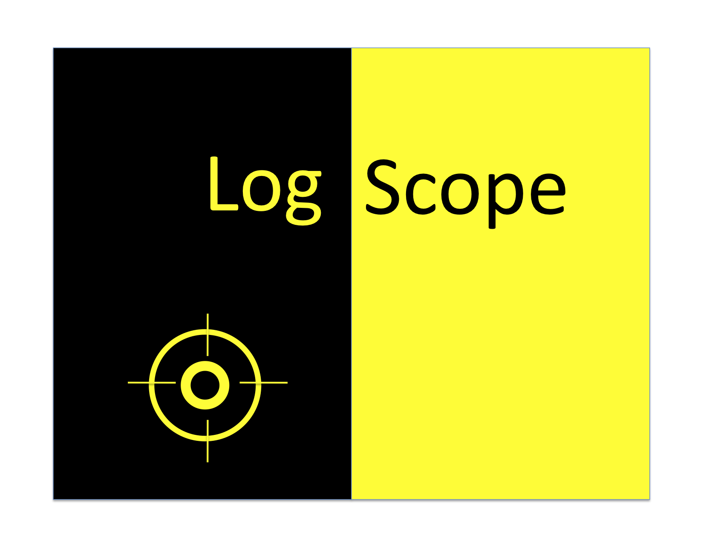
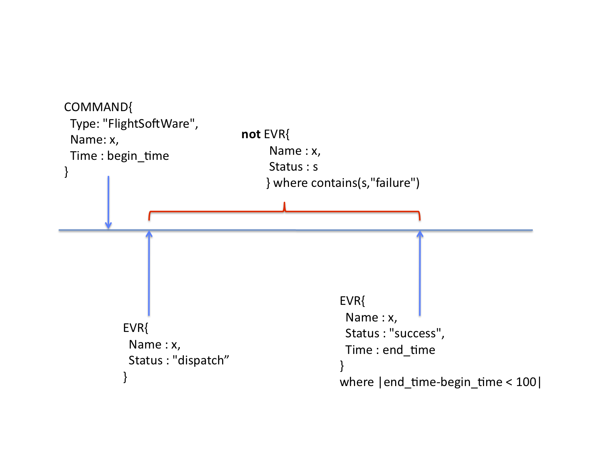
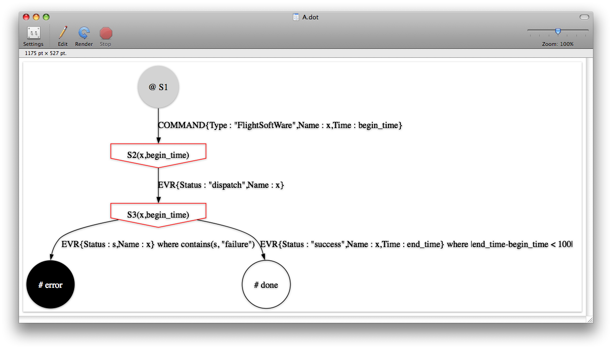

# LogScope 

## Specification-Based Log File Analysis

- User Manual : [manual/logscope-manual-2008.pdf](manual/logscope-manual-2008.pdf)
- Slides : [slides/compass09-logscope.ppt](slides/compass09-logscope.ppt)
- Paper : [papers/iaiaa-logscope10.pdf](papers/iaiaa-logscope10.pdf)
- Paper (shorter) : [papers/icse-logscope10.pdf](papers/icse-logscope10.pdf)
- Paper (yet shorter) : [papers/fma-logscope09.pdf](papers/fma-logscope09.pdf)

LogScope is a Python program for analyzing logs by checking them against log pattern specifications. The specification language is flexible, powerful and easy to use.

Logs can for example be generated from a running software system. LogScope assumes that logs are on a special form: Python sequences of events, where an event is a Python dictionary, mapping field names to values. It should be easy to convert any log file format to this format by writing a log converter (in Python for example).

Logscope was developed around 2008-2009 for the MSL FIT team,
and was used for a period. The work received JPL's internal Mariner Award in August 2009.

## Python 2

LogScope only compiles with Python 2 (not Python 3 at this point). The latest final version of Python 2 is version [2.7.18](https://www.python.org/downloads/release/python-2718/). Moving to Python 3 would be a minior effort. Contact me if this is crucial for your progress.

## Installation

Let `DIR` be the directory where you install LogScope. Do the following to run LogScope from the command line:

```bash
$ export PYTHONPATH=$PYTHONPATH:DIR/logscope
```

or use LogScope in a IDE.

## Running LogScope

To run LogScope on an example, do the following:

```bash
$ cd DIR/logscope/examples/example1
$ python script.py
```

The results will be stored in the `results` directory local to the example, as well as being printed on std out.

## An Example Temporal Pattern Specification:</b>

The following specification states that if the log contains a flight software `COMMAND` event, with a name `x`, and a time stamp `begin_time`, then eventually an `EVR` event should occur within 100 time units, and there should be no failure event in between.

```
pattern P :
  COMMAND{Type: "FlightSoftWare", Name: x, Time : begin_time} => 
    [
       EVR{Name : x, Status : "dispatch"}, 
     ! EVR{Name : x, Status : s} where contains(s,"failure"), 
       EVR{Name : x, Status : "success", Time : end_time} 
         where |end_time-begin_time < 100| 
    ]
```

This specification is illustrated by the following timeline:



## An Example Automaton Specification

The same property can also be stated in the lower level automaton language into which the temporal patterns are mapped. 

```
 automaton A {
  always S1 {
    COMMAND{Type : "FlightSoftWare",Name : x,Time : begin_time} => S2(x,begin_time)
  }

  hot state S2(x,begin_time) {
    EVR{,Name : x, Status : "dispatch"} => S3(x,begin_time)
  }

  hot state S3(x,begin_time) {
    EVR{Name : x, Status : s} where contains(s, "failure") => error
    EVR{Name : x, Status : "success",Time : end_time} 
       where |end_time-begin_time < 100| => done
  }
}
```
Such automata is visualized by the tool as follows:



## An Example Python Script

The following Python script (example 1 in distribution) creates a log of 3 events and checks it against the specification P above:

```
import lsm.lsm as lsm

log = [
          {"OBJ_TYPE" : "COMMAND", "Type" : "FlightSoftWare", "Name" : "PICT", "Time" : 1900},
          {"OBJ_TYPE" : "EVR", "Name" : "PICT", "Status" : "dispatch"},
          {"OBJ_TYPE" : "EVR", "Name" : "PICT", "Status" : "success", "Time" : 2950}        
       ]
           
lsm.setResultDir("results")   
observer = lsm.Observer("spec")
observer.monitor(log)
```

## Result of Analyis

As a result of the analysis a result report is generated, listing all errors found.

```
============================
       RESULTS FOR P:
============================

Errors: 1

*** violated: in hot end state:

  state S3(x,begin_time) {
    EVR{Status : s,Name : x} where contains(s, "failure") => error
    EVR{Status : "success",Name : x,Time : end_time} 
      where |end_time-begin_time < 100| => S4(x,begin_time,end_time)
  }
  with bindings: {'x': 'PICT', 'begin_time': 1900}

--- error trace: ---

COMMAND 1 {
  OBJ_TYPE := "COMMAND" - str
  Type := "FlightSoftWare" - str
  Name := "PICT" - str
  Time := 1900 - int
}

EVR 2 {
  Status := "dispatch" - str
  OBJ_TYPE := "EVR" - str
  Name := "PICT" - str
}

Statistics {
  COMMAND :
      {'Type': 'FlightSoftWare', 'Name': 'PICT', 'Time': 1900} -> 1
  EVR :
      {'Status': 'dispatch', 'Name': 'PICT'} -> 1
}
```

## Credits

LogScope was developed by:

- [Alex Groce](https://agroce.github.io)
- [Klaus Havelund](http://havelund.com)

at [Jet Propulsion Laboratory](https://www.jpl.nasa.gov/) (JPL) during 2008-2010 in support for the 
[Mars Science Laboratory](https://www.jpl.nasa.gov/missions/mars-science-laboratory-curiosity-rover-msl/) 
(MSL) mission.


